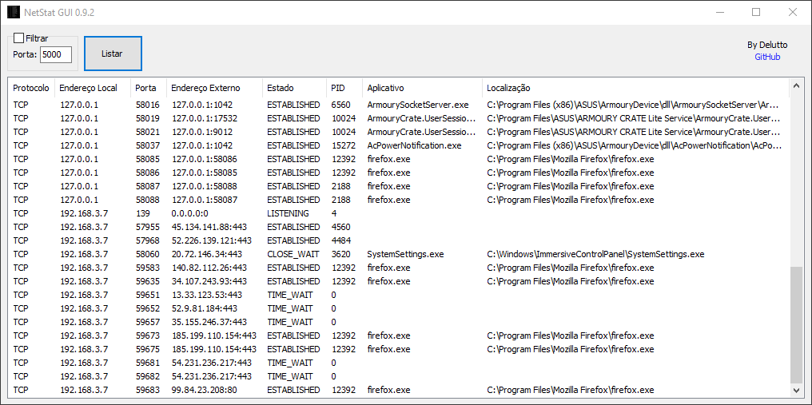
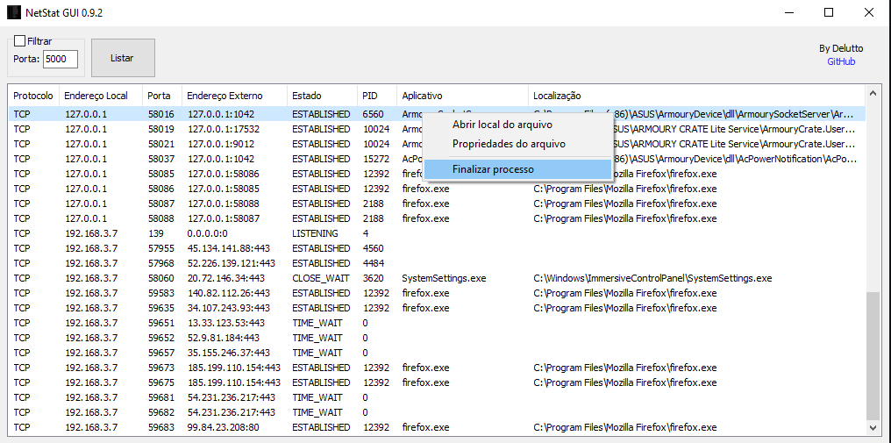

# NetStat GUI 0.9.2

NetStat GUI é uma ferramenta para listar as conexões e portas em uso pelo protocolo TCP no Windows.

[Download](https://raw.githubusercontent.com/Delutto/NetStatGUI/main/bin/NetStatGUI.exe)

